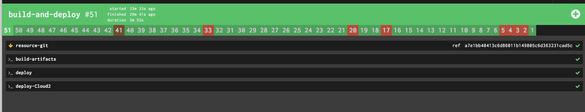
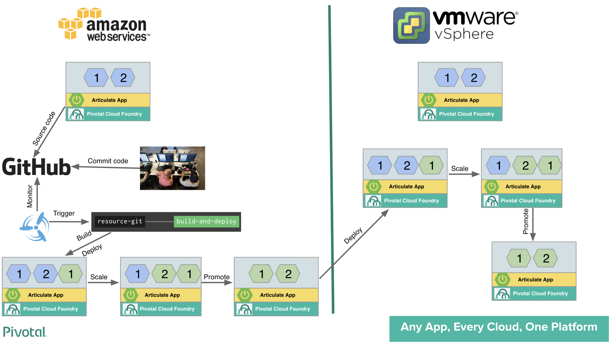

# Blue-Green deployment across multiple clouds

The main purposes here are to demonstrate Blue-Green deployment of Articulate application across two clouds. This tutorial can be easily expanded to include Atendee services as part of the deployment and also scale it to more than 2 clouds. Follow the steps below for setup and execution of this tutorial.

## Setup concourse locally

  1. Setup Concourse locally by following `Getting Started` section in https://concoursetutorial.com/ 
  2. Mirror this repository to your account as explained in https://help.github.com/articles/duplicating-a-repository/
  3. Clone your newly created repository to your local desktop / laptop by executing the git clone command

```
$ git clone https://<<your-repo>>/pcf101-articulate-attendee.git
```
  
 4. Edit `vars.yml` file under articulate\ci folder and update the following variables to point to your cloud instances

```
pcf-api: api.sys.pcf.aws.pcfjourney.com
pcf-username: admin
pcf-password: xxxxxxxxxxxxx
pcf-domain: apps.pcf.aws.pcfjourney.com
pcf-organization: UT
pcf-space: dev
...
cloud2-pcf-api: api.run.haas-90.pez.pivotal.io
cloud2-pcf-username: admin
cloud2-pcf-password: xxxxxxxxxxxx
cloud2-pcf-domain: cfapps.haas-90.pez.pivotal.io
cloud2-pcf-organization: UT
cloud2-pcf-space: dev

```
 5. Edit pipeline.yml file under articulate/ci folder and modify the resources section to point to your github repo
 
```
# GIT
- name: resource-git
  type: git
  source:
    uri: https://github.com/<<your repo>>/pcf101-articulate-attendee
    branch: master

```
 6. Install pipeline using the following command from the project root directory
 
```
fly -t tutorial set-pipeline -p <<pipeline-name>> -c articulate/ci/pipeline.yml -l articulate/ci/vars.yml

```

 7. Naviage to the pipleine UI (http://127.0.0.1:8080/teams/main/pipelines/<Pipeline-name> and trigger a build by clicking     on + sign on "build and deploy" task page as shown below
  
 
 
  8. You can see blue-articulate application deployed on two clouds. 
  
  9. Navigate to Blue-Green page, you can see the cloud name highlighted in green. The logic for the cloud name display is 
     based on `pcf-api` variable in the `vars.yml` and is implemented in `EnablementHelper.java` under 
     `articulate/src/main/java/io/pivotal/education/articulate/service` as shown below. Please 
     update the logic to fit your api end-point name and cloud provider.
 
 ```
     //Added to check the cloud based on api - Ahilan
    String cloudName = (String) getVcapApplicationMap().get("cf_api");
    if (cloudName.equals("https://api.sys.pcf.aws.pcfjourney.com")) {
      cloudName = "AWS";
    }else{
      cloudName = "vSphere";
    }
    
 ```
  10. Start the counter in both clouds so that you can see the blue-green action in real time.
  11. Edit layout.html under `templates/fragments` folder and un-comment the following lines
  
```
 <li></li>


```
  12. Check-in the the changes, you will see new build triggered automatically and Blue-Green deployment in action in 
      cloud1 followed by cloud 2. The following diagram shows the overall flow
      
     
 
     

 
# Credits

This project is originated from https://github.com/pivotal-education/pcf-articulate-code
